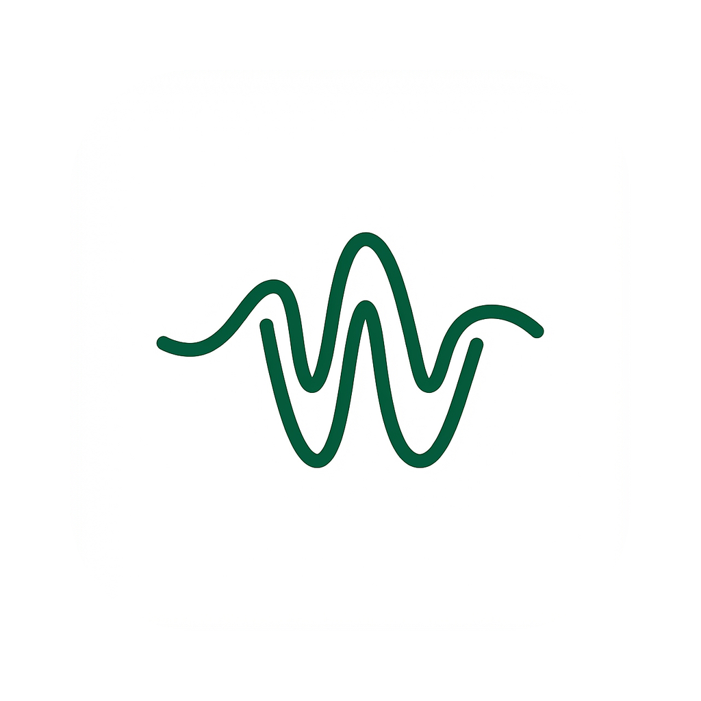

<p align="center">
  
</p>

<h1 align="center">Murmur</h1>

<p align="center">
  Local speech-to-text for macOS — press a hotkey, speak, text appears at your cursor.
</p>

<p align="center">
  <strong>100% on-device</strong> · Local speech engine · No cloud · Menu bar app
</p>

<br>

## Download

Get the latest **`.dmg`** from [GitHub Releases](https://github.com/Mbr0/murmur/releases).

1. Open the DMG and drag **Murmur** to **Applications**
2. Launch Murmur from Applications
3. Grant **Microphone** when prompted
4. For paste-at-cursor: menu bar → **Enable Shortcut Permission…** → allow **Accessibility**

A first-run wizard walks through the microphone and Accessibility checks, downloads a speech engine model, and lets you try a test sentence — skippable, and reopenable anytime from the menu bar. Signed builds check GitHub Releases for updates and verify the Developer ID signature before installing.

## How it works

| Step | What to do |
|------|------------|
| 1 | Click where you want text |
| 2 | Press **⌥ Space** to start recording |
| 3 | Speak |
| 4 | Press **⌥ Space** again to stop |
| 5 | Text is pasted and copied to the clipboard |

Change the shortcut anytime in **Settings**.

## Permissions

| Permission | Required for |
|------------|--------------|
| **Microphone** | Recording your voice |
| **Accessibility** | Pasting text at the cursor |

The global shortcut does **not** require Input Monitoring.

## Settings

Open **Settings** from the menu bar:

- Speech engine: whisper.cpp, or on Apple Silicon with 16 GB of RAM or more, Voxtral Mini 4B Realtime — models download on demand and are stored under `~/Library/Application Support/Murmur/models/`
- Push-to-talk mode: toggle, hold, or automatic
- Custom keyboard shortcut
- Language: auto-detect or a fixed language, remembered per app
- Vocabulary: bias terms and text replacements, import/export as CSV
- Dark / light / system appearance
- Optional local history and audio retention
- Delete all local data

## Menu bar

| State | What you see |
|-------|----------------|
| Ready | Waveform icon |
| Recording | Red indicator |
| Working | Processing spinner |

## Privacy

All transcription runs **locally** on your Mac. The local speech engine is [whisper.cpp](https://github.com/ggml-org/whisper.cpp) (bundled `whisper-server`, `large-v3-turbo`) or, on Apple Silicon with 16 GB of RAM or more, Voxtral Mini 4B Realtime through [mlx-audio](https://github.com/Blaizzy/mlx-audio). No audio or text is sent to the cloud. Speech engine models download on demand from **Settings → Speech engine** and live under `~/Library/Application Support/Murmur/models/`; history and audio files, when enabled, are stored under `~/.murmur_*`.

## Troubleshooting

<details>
<summary><strong>Shortcut not working</strong></summary>

Check the shortcut in **Settings** (default: **⌥ Space**). Quit Murmur completely and reopen it after changing the shortcut.
</details>

<details>
<summary><strong>Nothing pasted at the cursor</strong></summary>

Enable **Accessibility** for Murmur: menu bar → **Enable Shortcut Permission…**, then quit and reopen the app.
</details>

<details>
<summary><strong>No audio / model loading forever</strong></summary>

Allow **Microphone** access in System Settings. On first launch, the wizard downloads the speech engine model — this can take a few minutes depending on your connection and model size.
</details>

<details>
<summary><strong>Transcription is slow</strong></summary>

Use the quantised whisper.cpp model in **Settings → Speech engine** for speed, or the full-precision model for accuracy.
</details>

## Development

Requires macOS and Python 3.12+. Intel Macs run the whisper.cpp engine only; Voxtral Mini 4B Realtime needs Apple Silicon with 16 GB of RAM or more.

```bash
git clone https://github.com/Mbr0/murmur.git
cd murmur
chmod +x scripts/setup.sh scripts/run.sh
./scripts/setup.sh
./scripts/run.sh
```

Run tests:

```bash
source venv/bin/activate
python -m unittest discover -s tests -p "test_*.py"
```

## Acknowledgements

Local transcription runs on [whisper.cpp](https://github.com/ggml-org/whisper.cpp) (MIT) and, on Apple Silicon, Voxtral Mini 4B Realtime (Apache 2.0) through [mlx-audio](https://github.com/Blaizzy/mlx-audio) (MIT). Both build on research from [OpenAI Whisper](https://github.com/openai/whisper).

## License

[MIT](LICENSE)
